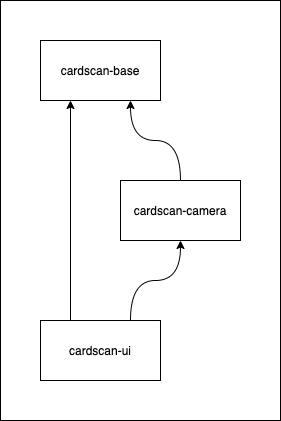

# Development

Development guide

## Contents

* [Code Organization](#code-organization)
* [Building](#building)
* [Running Unit Tests](#running-unit-tests)
* [Using Running Android Tests](#running-android-tests)
* [Releasing](#releasing)

## Code Organization

This android library builds on top of the framework in the [scan-framework library](https://github.com/getbouncer/scan-framework-android) to provide user interfaces for scanning. Anything specific to the user interface of scanning lives in this library.

This library consists of these modules:
* [scan-framework](#scan-framework)
* [scan-camera](#scan-camera)
* [scan-ui](#scan-ui)



### scan-framework

[scan-framework](https://github.com/getbouncer/scan-framework-android) contains the framework used to scan. See the [architecture document](https://github.com/getbouncer/scan-framework-android/blob/master/docs/architecture.md) for details on how it processes images from the camera.

### scan-camera

[scan-camera](https://github.com/getbouncer/scan-camera-android) contains the camera interfaces for setting up the camera on the device and receiving images from it. It also handles converting the images from the camera to a processable format.

### scan-ui

[scan-ui](https://github.com/getbouncer/scan-ui) contains some common functionality shared between user interfaces. This provides the viewfinder, debug overlay, and abstract scan activity.

## Building

Check out the project using `git`. Note that this project makes use of submodules, so a `recursive` clone is recommended.
```bash
git clone --recursive https://github.com/getbouncer/scan-ui-android
```

To build the project, run the following command:
```bash
./gradlew scan-ui:build
```

To create an AAR release of the app, run the following command:
```bash
./gradlew scan-ui:assembleRelease
```
This will place an AAR file in `scan-ui/build/outputs/aar`

## Contributing

This library follows a standard github contribution flow.

1. Create a new github feature branch
    ```bash
    git checkout -b <your_github_name>/<your_feature_name>
    ```

1. Make your code changes

1. Push your branch to origin
    ```bash
    git push --set-upstream origin <your_branch_name>
    ```

1. Create a new pull request on github, and tag appropriate owners.

1. Once you have approval, merge your branch into master and delete your feature branch from github.

## Running Unit Tests

Unit tests can be run from android studio or from the command line. To execute from the command line, run the following command:
```bash
./gradlew test
```

## Running Android Tests

Android tests can be run from android studio or from the command line. To execute from the command line, run the following command:
```bash
./gradlew connectedAndroidTest
```

Note that these tests require that you have an emulator running or a physical device connected to your machine via `ADB`.

## Releasing

See the [release](release.md) documentation.
